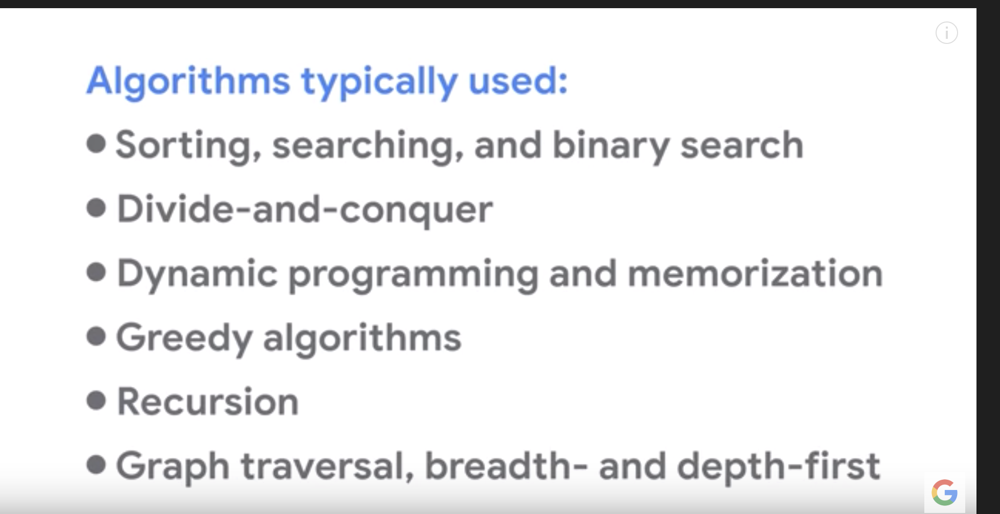

# algorithm-and-data-structure-interview-prep

In this repo I will put resources am using to prepare to an important interview.

I had 30 days to do it : 

The first [resource](https://qr.ae/TWFOK1) I will use.
Another resource is this [one](https://www.linkedin.com/pulse/interviewing-google-heres-6-things-you-absolutely-need-anthony-mays/?trk=pulse_spock-articles) 

Another book is cracking the code interview can be found anywhere on the internet.

## Day 1 and Day 2 : 

I will be doing a research on how the google interview goes, I will be preparing for the google one because it's the best company any one can dream about it's like playing in a top team in premier league, Manchester City. If you can pass the google interview you can pass any other company interview.

[Here](http://hbcuconnect.com/ads/google/GoogleSE.pdf) are tips from google.
There is another video showing how a [google interview goes](https://www.youtube.com/watch?v=XKu_SEDAykw&authuser=0) and [how to prepare](https://www.youtube.com/watch?v=6ZZX9iIgFoo&t=0s&authuser=0) for a google interview.

https://qr.ae/TWFiLX

### Day 1 Take away:
- Ask for clarifications, tell your plans (Real engineering problems )
- Think out loud about your solution and give your thought 
- Think about everything before writing them down.
- Test your code in the real time (Not unit test) test the code about agiainst the example
Try out edge cases.

Don't have to start with the best algorithms, iterating can be part of the process:

 Shows algorithms typically used during the interviews.

Choose a language you are comfortable with they know if you are comfortable with one language you can learn another.
They don't have to confuse you with programming languages trivias. 

Test test and test, know how to handle malformed inputs.

Practice on code and paper....

That all for today...

See you on day 2

### Day 2

Lost track for the project and end up spending 4 days but including weekend without working on his project. 

The good thing today is that the study plan is already made , the remaining steps are knowns let share the a list of stuffs I have to learn here.

It was taken from the book cracking the code interview:

| Topic | Category| Difficulty | Date Started | Date completed | Observation|
| -------- |:-----------:|:-----------:|:-----------:|:-----------:|:-----------:|
| Linked Lists | Data Structures | Medium | 28/10/2019 | 28/10/2019 | Nothing |
| Binary Trees | Data Structures | Medium |  |  | |
| Tries | Data Structures | Medium |  |  | |
| Stacks| Data Structures | Medium |  |  | |
| Queues | Data Structures | Medium |  |  | |
| Heap | Data Structures | Medium |  |  | |
| Vector / ArrayLists | Data Structures | Medium |  |  | |
| HashTables | Data Structures | Medium |  |  | |
| Breadth First Search | Algorithms | Medium |  |  | |
| Deep First Search | Algorithms | Medium |  |  | |
| Binary Search | Algorithms | Medium |  |  | |
| Merge Sort | Algorithms | Medium |  30/10/2019| 30/10/2019  | Completed well and blog post written |
| Quick Sort | Algorithms | Medium |  |  | |
| Other Sorting  | Algorithms | Medium |  |  | |
| Tree insert | Algorithms | Medium |  |  | |
| Bit Manipulation | Concepts | Medium |  |  | |
| Recursion | Concepts | Hard |  |  | |
| Big O Notation | Concepts | Easy |  |  | |
| Dynamic Programing | Concepts | Easy |  |  | |

## Benchmark yourself (days 3–5)

### Day 3 : Find The Kth Smallest/Largest Integer In An Array

Today I found [another resource](https://dev.to/seattledataguy/the-interview-study-guide-for-software-engineers-764) I bookmarked a some days ago, I lead me to [this spreadsheet](https://docs.google.com/spreadsheets/d/1cDnPdd45X2edeSF1l6WYWqmvPeKy1__uAbfKUlb2U6s/edit?usp=sharing) where I will tracking my progress.

I worked on the problem which was about finding the kth smallest/largest integer in an array

I manage to get a working solution but with nlog(n) time , it could be improved to a better solution with n runtime.

The improvement will require me to understand *Heap Data Structure* and *Quick Sort Algorithms*

The notebook generated for this problem can be found [here](./notebooks/smallest_item_in_an_array.ipynb)

### Day 4 learning about quick sort 

Ressources :

- [First Video](https://www.youtube.com/watch?v=SLauY6PpjW4&feature=youtu.be)
- [Second Video](https://www.youtube.com/watch?v=uXBnyYuwPe8)
- [Vaidehi Blog Post 1](https://dev.to/vaidehijoshi/pivoting-to-understand-quicksort-part-1)
- [Vaidehi Blog Post 2](https://dev.to/vaidehijoshi/pivoting-to-understand-quicksort-part-2)

This day everything went well, I learned a lot and I manage to get an understand of the quicksort algorithm. The remaining step is now to understand the math behind the big o notation calculation especially when we have a recursive solution.

Results : [Quick Sort Algorithm Example](./algorithms-notes/quicksort.md)
          [Quick Sort Algorithm Notebook Implementation](./notebooks/QuickSort.ipynb)

Next topics : *How we calculate the big O notation for a part of code*
